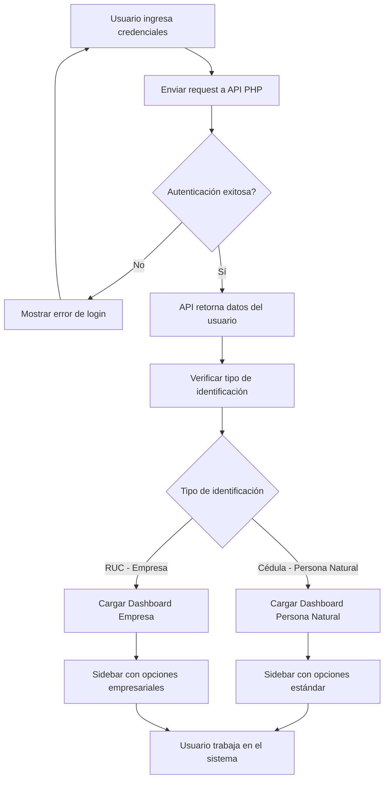

# Sistema de Discriminación de Usuarios - Frontend Coop

## 📋 Descripción

Este sistema implementa la discriminación automática de usuarios entre **Persona Natural** (Cédula) y **Empresa** (RUC), mostrando menús y funcionalidades diferenciadas según el tipo de usuario.

## 🚀 Características Implementadas

### 1. Detección Automática de Tipo de Usuario

- **Persona Natural**: Identificación con 10 dígitos (cédula ecuatoriana)
- **Empresa**: Identificación con 13 dígitos terminados en "001" (RUC ecuatoriano)

### 2. Menús Diferenciados

#### 👤 Persona Natural (Cédula)
- **Mis Productos**: Ahorros, Créditos, Inversiones, Seguros, Tarjetas
- **Transferencias**: Internas, Internacionales
- **Servicios**: Pago de servicios Facilito, Certificados (si disponible)
- **Mi Perfil**: Información personal, Cambio de clave
- **Términos y Condiciones**

#### 🏢 Empresa (RUC)
- **Productos Empresariales**: Cuentas empresariales, Líneas de crédito, Inversiones corporativas, Seguros corporativos
- **Transferencias**: Internas, Externas, Internacionales
- **Pago de Nómina**: Procesar nómina, Historial, Gestión de empleados
- **Cash Management**: Gestión de tesorería, Transferencias masivas, Gestión de liquidez
- **Gestión de Usuarios**: Usuarios empresa, Permisos y roles, Logs de auditoría
- **Reportes Corporativos**: Financieros, Transacciones, Cumplimiento
- **Perfil Empresarial**: Información empresarial, Cambio de clave
- **Términos y Condiciones**

## 🔧 Archivos Modificados/Creados

### Archivos Principales
- `src/services/apiService.js` - Lógica de detección de tipo de usuario
- `src/config/menuConfig.js` - Configuración de menús por tipo de usuario
- `src/components/dashboard/Sidebar.jsx` - Sidebar con menús dinámicos
- `src/components/dashboard/Dashboard.jsx` - Dashboard con componentes empresariales
- `src/components/LoginPage.jsx` - Login con mensaje personalizado por tipo

### Componentes Empresariales
- `src/components/dashboard/empresa/PayrollProcessingForm.jsx` - Procesamiento de nómina
- `src/components/dashboard/empresa/BulkTransfersForm.jsx` - Transferencias masivas
- `src/components/dashboard/empresa/CompanyUsersForm.jsx` - Gestión de usuarios
- `src/components/dashboard/empresa/index.js` - Exportaciones de componentes
- `src/components/dashboard/UserTypeFlowDiagram.jsx` - Diagrama informativo

## 🎯 Flujo de Funcionamiento



## 🛠️ Implementación Técnica

### 1. Detección de Tipo de Usuario (apiService.js)

```javascript
detectUserType(identificacion) {
  if (!identificacion) return 'unknown';
  
  const id = identificacion.toString().trim();
  
  // RUC ecuatoriano: 13 dígitos y termina en 001
  if (id.length === 13 && id.endsWith('001')) {
    return 'empresa';
  }
  
  // Cédula ecuatoriana: 10 dígitos
  if (id.length === 10) {
    return 'persona_natural';
  }
  
  return 'unknown';
}
```

### 2. Configuración de Menús (menuConfig.js)

```javascript
export const getMenuByUserType = (tipoUsuario) => {
  switch (tipoUsuario) {
    case 'empresa':
      return EMPRESA_MENU;
    case 'persona_natural':
      return PERSONA_NATURAL_MENU;
    default:
      return PERSONA_NATURAL_MENU;
  }
};
```

### 3. Sidebar Dinámico

```javascript
useEffect(() => {
  if (userInfo) {
    const userType = apiService.getUserType();
    setTipoUsuario(userType);
    
    const baseMenu = getMenuByUserType(userType);
    setMenuItems(baseMenu);
    
    checkServiciosAvailability();
  }
}, [userInfo]);
```

## 🎨 Características Visuales

### Indicadores de Tipo de Usuario
- **Persona Natural**: Badge azul con icono 👤
- **Empresa**: Badge dorado con icono 🏢
- **Desconocido**: Badge gris con icono ❓

### Componentes Empresariales
- Interfaces especializadas para funciones corporativas
- Diseño consistente con el sistema existente
- Componentes reutilizables y escalables

## 📱 Responsive Design

- Todos los componentes son responsive
- Adapta correctamente en dispositivos móviles y desktop
- Mantiene la usabilidad en diferentes resoluciones

## 🔐 Seguridad

- Validación del tipo de usuario en cada sesión
- Menús mostrados únicamente según permisos
- Detección automática basada en estructura de identificación

## 🚀 Escalabilidad

- Sistema modular y extensible
- Fácil agregar nuevos tipos de usuario
- Configuración centralizada de menús
- Componentes reutilizables

## 📋 Próximos Pasos

1. **Implementar APIs específicas** para funciones empresariales
2. **Agregar más validaciones** de permisos por rol
3. **Implementar cache** de configuración de menús
4. **Agregar más tipos de usuario** si es necesario
5. **Implementar auditoría** de acciones por tipo de usuario

## 🐛 Testing

- Probar con usuarios de cédula (10 dígitos)
- Probar con usuarios de RUC (13 dígitos terminados en 001)
- Verificar cambio de menús según tipo
- Validar funcionalidad de componentes empresariales

## 💡 Notas Importantes

- El sistema es retrocompatible con usuarios existentes
- Los servicios Facilito siguen funcionando según disponibilidad
- Los componentes empresariales son placeholders funcionales
- El diseño mantiene la identidad visual de Las Naves